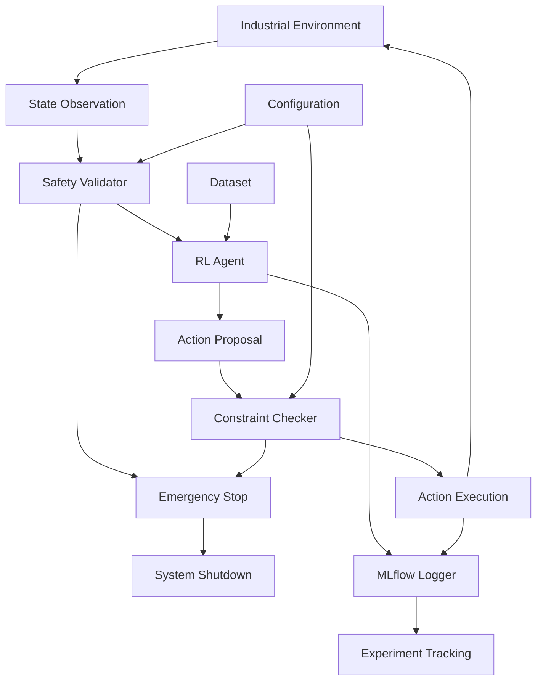

# Architecture Overview

This document describes the high-level architecture of neoRL-industrial-gym.

## System Design

```
┌─────────────────┐    ┌─────────────────┐    ┌─────────────────┐
│   Environments  │    │     Agents      │    │   Evaluation    │
│                 │    │                 │    │                 │
│ • ChemicalReactor│    │ • CQL          │    │ • Safety Monitor│
│ • RobotAssembly │◄───┤ • IQL          │────┤ • Performance   │
│ • HVACControl   │    │ • TD3+BC       │    │ • Compliance    │
│ • WaterTreatment│    │ • COMBO        │    │ • Visualization │
│ • SteelAnnealing│    │ • Custom       │    └─────────────────┘
│ • PowerGrid     │    └─────────────────┘              │
│ • SupplyChain   │                                     │
└─────────────────┘                                     │
         │                                              │
         ▼                                              ▼
┌─────────────────┐                            ┌─────────────────┐
│    Datasets     │                            │    Tracking     │
│                 │                            │                 │
│ • Expert        │                            │ • MLflow        │
│ • Medium        │                            │ • Weights & B   │
│ • Mixed         │                            │ • TensorBoard   │
│ • Random        │                            │ • Neptune       │
└─────────────────┘                            └─────────────────┘
```

## Core Components

### 1. Industrial Environments

Real-world inspired simulations based on actual factory PID/PLC control loops:

- **State Space**: Multi-dimensional continuous states representing system variables
- **Action Space**: Continuous control inputs with safety constraints  
- **Dynamics**: Physics-based models derived from real industrial processes
- **Safety Constraints**: Hard and soft constraints based on operational limits

### 2. Offline RL Agents

JAX-accelerated implementations of state-of-the-art offline RL algorithms:

- **Conservative Q-Learning (CQL)**: Prevents overestimation of out-of-distribution actions
- **Implicit Q-Learning (IQL)**: Avoids explicit policy constraints through implicit Q-learning
- **TD3+BC**: Combines TD3 with behavioral cloning for offline settings
- **COMBO**: Model-based approach with uncertainty quantification

### 3. Safety Systems

Industrial-grade safety monitoring and constraint enforcement:

- **Real-time Monitoring**: Continuous evaluation of safety metrics
- **Emergency Shutdown**: Automated system halt on constraint violations
- **Human Override**: Manual intervention capabilities
- **Audit Logging**: Comprehensive action and decision logging

### 4. Data Management

Standardized datasets following D4RL conventions:

- **Quality Levels**: Expert, medium, mixed, and random quality trajectories
- **Storage Format**: HDF5 for efficient large-scale data handling
- **Preprocessing**: Normalization and feature engineering pipelines
- **Validation**: Data integrity and safety constraint verification

## Technical Stack

### Core Technologies

- **JAX**: High-performance numerical computing with XLA compilation
- **Optree**: Efficient tree data structure operations
- **MLflow**: Experiment tracking and model management
- **Gymnasium**: Environment interface compatibility
- **H5PY**: Large-scale data storage and retrieval

### Development Tools

- **Black + Isort**: Code formatting and import organization
- **MyPy**: Static type checking for reliability
- **Pytest**: Comprehensive testing framework
- **Pre-commit**: Automated code quality enforcement

## Safety Architecture

### Constraint Hierarchy

1. **Hard Constraints**: Never violate (system shutdown)
2. **Soft Constraints**: Minimize violations (penalty rewards)  
3. **Preference Constraints**: Optimize when possible

### Monitoring Stack

```
Application Layer    │ Policy Execution
                    │ 
Safety Layer        │ Constraint Checking → Emergency Shutdown
                    │ 
Logging Layer       │ Action/State Logging → Audit Trail
                    │ 
Infrastructure      │ Hardware Interfaces → Real Systems
```

## Scalability Considerations

### Computational Scaling

- **JAX JIT Compilation**: Optimized execution graphs
- **Vectorized Environments**: Parallel simulation for faster training
- **GPU Acceleration**: Optional CUDA support for large models
- **Distributed Training**: Multi-device synchronization capabilities

### Data Scaling

- **Lazy Loading**: On-demand dataset loading to manage memory
- **Chunked Processing**: Handle datasets larger than memory
- **Compression**: Efficient storage of trajectory data
- **Caching**: Intelligent caching of preprocessed data

## Integration Points

### External Systems

- **Factory PLCs**: Direct interface to industrial control systems
- **SCADA Systems**: Integration with supervisory control systems
- **MES/ERP**: Connection to manufacturing execution systems
- **Cloud Services**: Remote monitoring and management

### Monitoring & Observability  

- **Metrics Collection**: Prometheus-compatible metrics
- **Log Aggregation**: Structured logging with correlation IDs
- **Alerting**: Real-time notification of safety violations
- **Dashboards**: Grafana-based visualization of system health

## Security Considerations

### Industrial Cybersecurity

- **Network Segmentation**: Isolated operational networks
- **Authentication**: Multi-factor authentication for critical operations
- **Encryption**: End-to-end encryption of sensitive data
- **Audit Trails**: Immutable logging of all system interactions

### AI Safety

- **Model Validation**: Extensive testing before deployment
- **Uncertainty Quantification**: Confidence bounds on predictions
- **Adversarial Robustness**: Protection against input perturbations
- **Explainability**: Interpretable decision-making processes

## Data Flow Architecture

### Training Pipeline
```
Raw Industrial Data → Preprocessing → Quality Assessment → Dataset Creation
       ↓                  ↓              ↓                    ↓
   Normalization      Feature Eng    Safety Validation   HDF5 Storage
       ↓                  ↓              ↓                    ↓
   Offline RL Agent ← Dataset Loading ← Batch Processing ← MLflow Tracking
```

### Inference Pipeline  
```
Real-time State → Safety Check → Policy Inference → Action Validation → System Output
       ↓              ↓              ↓                 ↓                 ↓
   Normalization   Constraint     JAX Forward      Safety Filter    PLC Interface
       ↓          Verification      Pass             ↓                 ↓
   Logging ←─────────────────────────────────────── Audit Trail ← Emergency Stop
```

### Component Interactions



## Performance Characteristics

### Latency Requirements
- **Policy Inference**: <10ms for real-time control
- **Safety Checking**: <1ms for critical constraints
- **Data Logging**: <100ms for audit compliance
- **Emergency Response**: <500µs for shutdown procedures

### Throughput Specifications
- **Concurrent Environments**: 1000+ parallel simulations
- **Training Throughput**: 1M+ transitions per second
- **Data Processing**: 10GB/hour continuous ingestion
- **Model Serving**: 10K+ inferences per second

This architecture ensures both research flexibility and industrial deployment readiness while maintaining the highest safety standards.