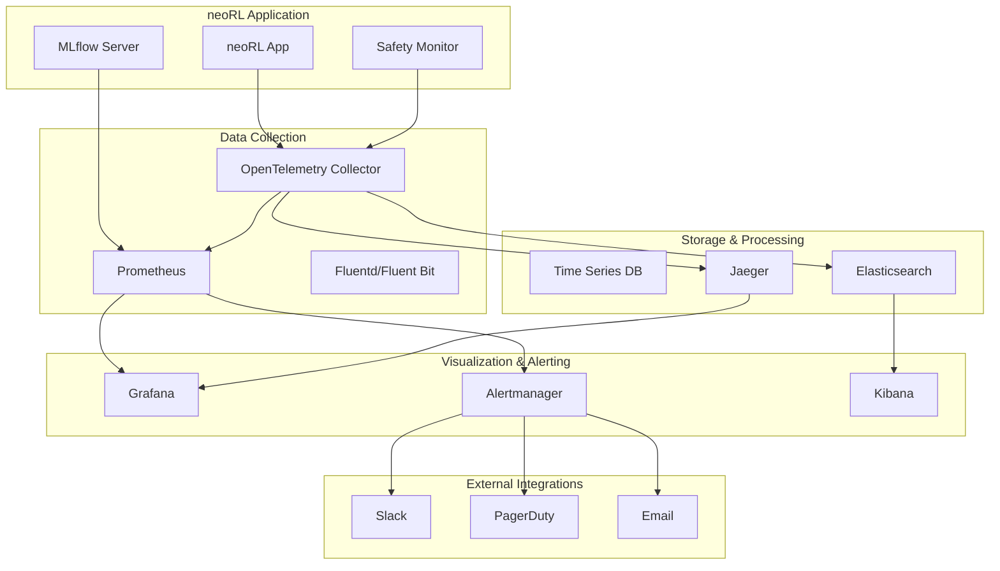

# Observability Guide

This guide covers the comprehensive observability stack for neoRL-industrial-gym, including monitoring, logging, tracing, and alerting.

## Architecture Overview



## Components Overview

### 1. Metrics Collection
- **Prometheus**: Time-series metrics collection and storage
- **OpenTelemetry**: Unified observability framework for metrics, traces, and logs
- **Node Exporter**: System-level metrics collection
- **cAdvisor**: Container metrics collection

### 2. Distributed Tracing
- **Jaeger**: Distributed tracing system
- **OpenTelemetry**: Trace instrumentation and collection
- **Zipkin**: Alternative tracing backend (optional)

### 3. Log Management
- **Elasticsearch**: Log storage and search
- **Kibana**: Log visualization and analysis
- **Fluentd/Fluent Bit**: Log collection and forwarding

### 4. Visualization
- **Grafana**: Metrics dashboards and visualization
- **Kibana**: Log analysis and visualization
- **Jaeger UI**: Trace visualization and analysis

### 5. Alerting
- **Alertmanager**: Alert routing and notification
- **Grafana Alerts**: Dashboard-based alerting
- **Prometheus Rules**: Metric-based alert rules

## Metrics Architecture

### Core Metrics Categories

#### 1. Safety Metrics (Critical)
```prometheus
# Safety constraint violations
safety_violations_total{constraint_type="temperature|pressure|flow"}

# Emergency shutdowns
emergency_shutdowns_total{reason="constraint_violation|system_failure"}

# Safety system health
safety_system_health{component="monitor|validator|shutdown"}
```

#### 2. Performance Metrics
```prometheus
# Inference latency
inference_latency_seconds_bucket

# Throughput
actions_computed_total
episodes_completed_total

# Resource utilization
process_resident_memory_bytes
process_cpu_seconds_total
```

#### 3. System Health Metrics
```prometheus
# Service availability
up{job="neorl-app|safety-monitor|mlflow"}

# HTTP request metrics
http_requests_total{method, status_code}
http_request_duration_seconds

# Database connections
database_connections_active
database_query_duration_seconds
```

#### 4. Business Logic Metrics
```prometheus
# Model performance
model_accuracy_score
model_drift_score
episode_reward_total

# Data quality
data_validation_failures_total
training_data_freshness_seconds
```

### Custom Metrics Implementation

```python
from prometheus_client import Counter, Histogram, Gauge, CollectorRegistry

# Create custom registry for isolation
registry = CollectorRegistry()

# Safety metrics
safety_violations = Counter(
    'safety_violations_total',
    'Total number of safety constraint violations',
    ['constraint_type', 'severity'],
    registry=registry
)

emergency_shutdowns = Counter(
    'emergency_shutdowns_total', 
    'Total number of emergency shutdowns',
    ['reason', 'component'],
    registry=registry
)

# Performance metrics
inference_latency = Histogram(
    'inference_latency_seconds',
    'Time spent on policy inference',
    ['model_type', 'environment'],
    buckets=[0.001, 0.005, 0.01, 0.025, 0.05, 0.1, 0.25, 0.5, 1.0],
    registry=registry
)

# Resource metrics
gpu_memory_usage = Gauge(
    'gpu_memory_usage_bytes',
    'GPU memory usage in bytes', 
    ['device_id'],
    registry=registry
)
```

## Distributed Tracing

### Trace Instrumentation

#### Automatic Instrumentation
```python
from opentelemetry.auto_instrumentation import configure_auto_instrumentation

# Auto-instrument common libraries
configure_auto_instrumentation(
    service_name="neorl-industrial-gym",
    service_version="0.1.0",
    resource_attributes={
        "service.namespace": "industrial-ai",
        "deployment.environment": "production"
    }
)
```

#### Manual Instrumentation
```python
from opentelemetry import trace
from opentelemetry.trace import Status, StatusCode

tracer = trace.get_tracer(__name__)

@tracer.start_as_current_span("policy_inference")
def predict_action(observation):
    with tracer.start_as_current_span("preprocessing") as span:
        span.set_attribute("observation.shape", str(observation.shape))
        processed_obs = preprocess(observation)
        
    with tracer.start_as_current_span("model_forward") as span:
        span.set_attribute("model.type", "CQL")
        action = model.forward(processed_obs)
        
    with tracer.start_as_current_span("safety_check") as span:
        is_safe = safety_validator.check(observation, action)
        span.set_attribute("safety.is_safe", is_safe)
        
        if not is_safe:
            span.set_status(Status(StatusCode.ERROR, "Safety constraint violated"))
            span.record_exception(SafetyViolationError("Action failed safety check"))
            
    return action
```

#### Safety-Critical Tracing
```python
@tracer.start_as_current_span("safety_critical_operation")
def emergency_shutdown(reason: str):
    span = trace.get_current_span()
    span.set_attribute("safety.critical", True)
    span.set_attribute("shutdown.reason", reason)
    span.set_attribute("shutdown.timestamp", time.time())
    
    # Always sample safety-critical traces
    span.set_attribute("sampling.priority", 1)
    
    try:
        # Perform shutdown sequence
        stop_all_processes()
        engage_safety_systems() 
        notify_operators()
        
        span.set_status(Status(StatusCode.OK, "Emergency shutdown completed"))
    except Exception as e:
        span.record_exception(e)
        span.set_status(Status(StatusCode.ERROR, str(e)))
        raise
```

### Trace Sampling Strategies

#### Probabilistic Sampling
```yaml
# For high-volume production workloads
probabilistic_sampler:
  sampling_percentage: 1.0  # 1% of normal traces
```

#### Intelligent Sampling
```yaml
tail_sampling:
  policies:
    # Always sample safety-critical operations
    - name: safety_critical
      type: string_attribute
      string_attribute:
        key: safety.critical
        values: ["true"]
      spans_per_second: -1  # No limit
    
    # Always sample errors
    - name: errors
      type: status_code
      status_code:
        status_codes: [ERROR]
      spans_per_second: 100
    
    # Sample slow operations
    - name: slow_operations
      type: latency
      latency:
        threshold_ms: 100
      spans_per_second: 50
```

## Log Management

### Structured Logging

```python
import structlog
import sys

# Configure structured logging
structlog.configure(
    processors=[
        structlog.stdlib.filter_by_level,
        structlog.stdlib.add_logger_name,
        structlog.stdlib.add_log_level,
        structlog.stdlib.PositionalArgumentsFormatter(),
        structlog.processors.TimeStamper(fmt="iso"),
        structlog.processors.StackInfoRenderer(),
        structlog.processors.format_exc_info,
        structlog.processors.UnicodeDecoder(),
        structlog.processors.JSONRenderer()
    ],
    context_class=dict,
    logger_factory=structlog.stdlib.LoggerFactory(),
    wrapper_class=structlog.stdlib.BoundLogger,
    cache_logger_on_first_use=True,
)

logger = structlog.get_logger()

# Usage examples
logger.info("Policy inference started", 
           observation_shape=observation.shape,
           model_type="CQL",
           episode_id=episode_id)

logger.error("Safety violation detected",
            constraint_type="temperature", 
            current_value=temp,
            threshold=max_temp,
            severity="critical",
            safety_critical=True)
```

### Log Aggregation Pipeline

```yaml
# Fluentd configuration for log collection
<source>
  @type tail
  path /var/log/neorl-industrial/*.log
  pos_file /var/log/fluentd/neorl-industrial.log.pos
  tag neorl.application
  format json
  time_key timestamp
  time_format %Y-%m-%dT%H:%M:%S.%fZ
</source>

<filter neorl.**>
  @type parser
  key_name message
  reserve_data true
  <parse>
    @type json
  </parse>
</filter>

<filter neorl.**>
  @type record_transformer
  <record>
    service_name neorl-industrial-gym
    environment ${ENV}
    cluster_name ${CLUSTER_NAME}
  </record>
</filter>

<match neorl.**>
  @type elasticsearch
  host elasticsearch
  port 9200
  index_name neorl-industrial
  type_name _doc
  logstash_format true
  logstash_prefix neorl-industrial
  logstash_dateformat %Y.%m.%d
  include_tag_key true
  tag_key @tag
  flush_interval 10s
</match>
```

## Alerting Strategy

### Alert Severity Levels

#### Critical (P0) - Immediate Response
- Safety system failures
- Emergency shutdowns
- Service unavailability
- Security breaches

#### High (P1) - 1-4 Hour Response  
- Performance degradation affecting operations
- Data integrity issues
- Non-critical system failures
- Resource exhaustion warnings

#### Medium (P2) - Same Day Response
- Performance warnings
- Monitoring system issues
- Non-urgent security alerts
- Capacity planning alerts

#### Low (P3) - Best Effort
- Informational alerts
- Maintenance notifications
- Development environment issues

### Alert Routing

```yaml
# Route safety-critical alerts immediately
routes:
  - match:
      category: safety
      severity: critical
    receiver: 'safety-emergency'
    group_wait: 0s
    repeat_interval: 5m
    continue: true  # Also send to default channels
    
  - match:
      severity: critical
    receiver: 'ops-critical'
    group_wait: 30s
    repeat_interval: 1h
    
  - match:
      severity: warning
    receiver: 'ops-warnings'  
    group_wait: 5m
    repeat_interval: 24h
```

### Runbook Integration

Each alert includes a runbook URL for standardized response procedures:

```yaml
annotations:
  runbook_url: "https://runbooks.neorl-industrial.com/alerts/{{ $labels.alertname | toLower }}"
  summary: "{{ $labels.alertname }} - {{ $labels.instance }}"
  description: |
    {{ $labels.alertname }} has been triggered.
    
    Current value: {{ $value }}
    Instance: {{ $labels.instance }}
    Service: {{ $labels.job }}
    
    See runbook for investigation steps.
```

## Dashboard Configuration

### Executive Dashboard
- System health overview
- Safety metrics summary
- Performance KPIs
- Alert summary

### Operations Dashboard  
- Detailed system metrics
- Resource utilization
- Service health
- Error rates and latencies

### Safety Dashboard
- Real-time safety metrics
- Constraint violation history
- Emergency shutdown logs
- Safety system health

### Performance Dashboard
- Inference latency percentiles
- Throughput metrics
- Resource utilization trends  
- Model performance metrics

## Best Practices

### 1. Metric Naming
- Use consistent naming conventions
- Include units in metric names
- Use labels for dimensions, not metric names
- Follow Prometheus naming guidelines

### 2. Alert Design
- Make alerts actionable
- Include context in alert messages
- Avoid alert fatigue with proper routing
- Test alert delivery mechanisms

### 3. Trace Sampling
- Use intelligent sampling for production
- Always sample safety-critical operations
- Consider cost vs. observability trade-offs
- Monitor sampling effectiveness

### 4. Log Management
- Use structured logging consistently
- Include correlation IDs for tracing
- Sanitize sensitive information
- Implement log retention policies

### 5. Security Considerations
- Encrypt data in transit
- Implement proper access controls
- Audit observability system access
- Sanitize sensitive data in metrics/logs

## Monitoring Checklist

### Pre-Production
- [ ] All services instrumented with metrics
- [ ] Critical alerts configured and tested
- [ ] Runbooks created for all alerts
- [ ] Dashboards created and validated
- [ ] Log aggregation pipeline tested
- [ ] Trace sampling configured appropriately

### Production Readiness
- [ ] Alert routing tested end-to-end
- [ ] Monitoring system redundancy configured
- [ ] Data retention policies implemented
- [ ] Access controls configured
- [ ] Incident response procedures documented
- [ ] Monitoring system monitoring configured

### Ongoing Maintenance
- [ ] Regular alert tuning and cleanup
- [ ] Dashboard maintenance and updates
- [ ] Metric cardinality monitoring
- [ ] Storage capacity planning
- [ ] Performance optimization
- [ ] Security audit and updates